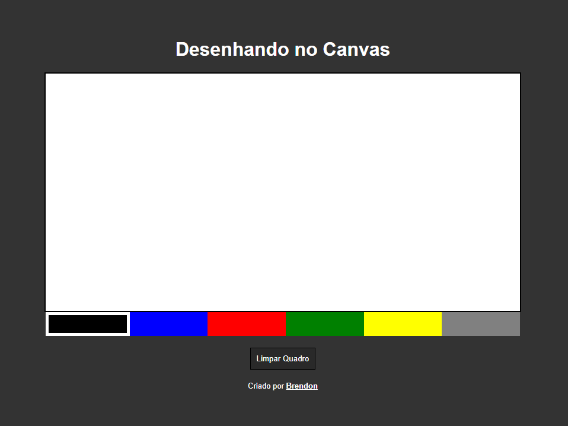
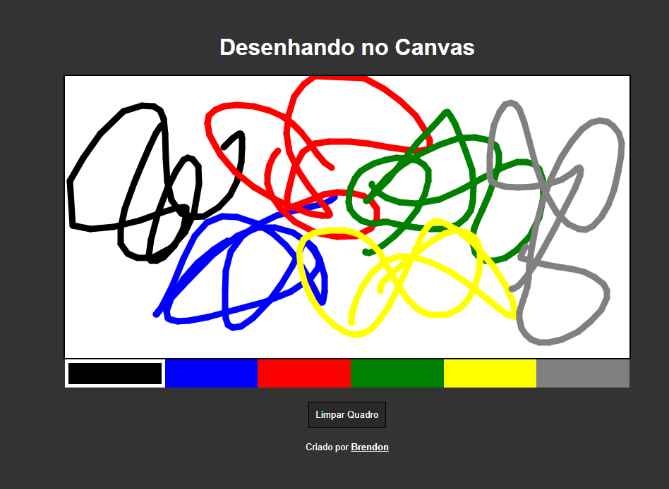

# Desenhando no Canvas

Este é um pequeno projeto utilizando canvas. Foi bom para praticar a definição das posições do mouse, eventos de click e criar novas funções.

# 

Imagens do projeto 

(Link no final) 

 

Link: https://brendonssilva.github.io/Desenhando-no-Canvas/